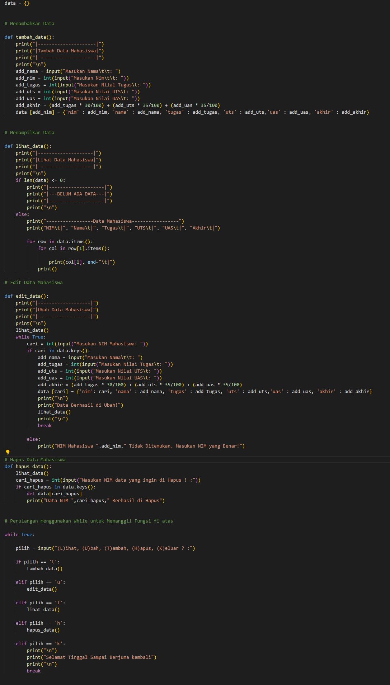

# Praktikum 6 Fungsi
## Tugas Praktikum
<br/>
Buat program sederhana dengan mengaplikasikan penggunaan fungsi
yang akan menampilkan daftar nilai mahasiswa, dengan ketentuan:<br/>
- Fungsi tambah() untuk menambah data<br/>
- Fungsi tapilkan() untuk menampilkan data<br/>
- Fungsi hapus(nama) untuk menghapus data berdasarkan nama<br/>
- Fungsi ubah(nama) untuk mengubah data berdasarkan nama<br/>
- Buat flowchart dan penjelasan programnya pada README.md.<br/>
- Commit dan push repository ke github.

### Source Code 
<br/>

## Penjelasan 

1. Pertama saya buat dulu dictionary Kosong untuk menampung data <br/>
```python
data = {}
```
2. Seletah itu saya membuat Fungsi def untuk masing masing fungsi<br/>

- Tambah Data
```python
def tambah_data():
    print("|---------------------|")
    print("|Tambah Data Mahasiswa|")
    print("|---------------------|")
    print("\n")
    add_nama = input("Masukan Nama\t\t: ")
    add_nim = int(input("Masukan Nim\t\t: "))
    add_tugas = int(input("Masukan Nilai Tugas\t: "))
    add_uts = int(input("Masukan Nilai UTS\t: "))
    add_uas = int(input("Masukan Nilai UAS\t: "))
    add_akhir = (add_tugas * 30/100) + (add_uts * 35/100) + (add_uas * 35/100)
    data [add_nim] = {'nim' : add_nim, 'nama' : add_nama, 'tugas' : add_tugas, 'uts' : add_uts,'uas' : add_uas, 'akhir' : add_akhir}
```
- Lihat Data
```python
def lihat_data():
    print("|--------------------|")
    print("|Lihat Data Mahasiswa|")
    print("|--------------------|")
    print("\n")
    if len(data) <= 0:
        print("|--------------------|")
        print("|---BELUM ADA DATA---|")
        print("|--------------------|")
        print("\n")
    else:
        print("-----------------Data Mahasiswa-----------------")
        print("NIM\t|", "Nama\t|", "Tugas\t|", "UTS\t|", "UAS\t|", "Akhir\t|")
        
        for row in data.items():
            for col in row[1].items():
                
                print(col[1], end="\t|")
            print()
```
- Ubah Data
```python
def edit_data():
    print("|-------------------|")
    print("|Ubah Data Mahasiswa|")
    print("|-------------------|")
    print("\n")
    lihat_data()
    while True:
        cari = int(input("Masukan NIM Mahasiswa: "))
        if cari in data.keys():
            add_nama = input("Masukan Nama\t\t: ")
            add_tugas = int(input("Masukan Nilai Tugas\t: "))
            add_uts = int(input("Masukan Nilai UTS\t: "))
            add_uas = int(input("Masukan Nilai UAS\t: "))
            add_akhir = (add_tugas * 30/100) + (add_uts * 35/100) + (add_uas * 35/100)
            data [cari] = {'nim': cari, 'nama' : add_nama, 'tugas' : add_tugas, 'uts' : add_uts,'uas' : add_uas, 'akhir' : add_akhir}
            print("\n")
            print("Data Berhasil di Ubah!")
            lihat_data()
            print("\n")
            break
        
        else:
            print("NIM Mahasiswa ",add_nim," Tidak Ditemukan, Masukan NIM yang Benar!")
```

- Hapus Data
```python
def hapus_data():
    lihat_data()
    cari_hapus = int(input("Masukan NIM data yang ingin di Hapus ! :"))
    if cari_hapus in data.keys():
        del data[cari_hapus]
        print("Data NIM ",cari_hapus," Berhasil di Hapus")
```

3. Setelah Semua Fungsi yang di butuhkan sudah dibuat saya melakukan perulangan menggunakan ```python while True: ``` untuk memanggil fungsi yang telah saya buat sebelumnya

```python
while True:

    pilih = input("(L)ihat, (U)bah, (T)ambah, (H)apus, (K)eluar ? :")

    if pilih == 't':
        tambah_data()
        
    elif pilih == 'u':
        edit_data()
        
    elif pilih == 'l':
        lihat_data()
        
    elif pilih == 'h':
        hapus_data()
        
    elif pilih == 'k':
        print("\n")
        print("Selamat Tinggal Sampai Berjuma kembali")
        print("\n")
        break
```
